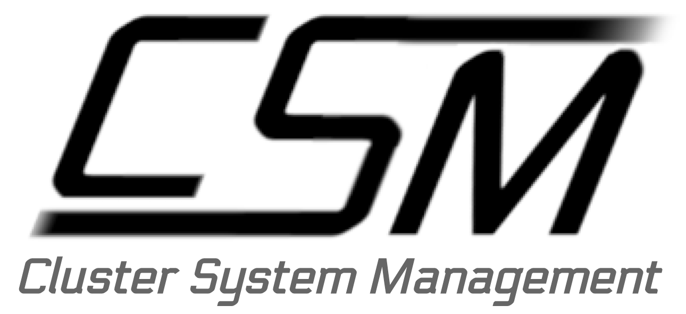

CSM APIs
========

CSM uses APIs to communicate between its sub systems and to external programs. This section is a general purpose guide for interacting with CSM APIs. 

This section is divided into the following subsections:

.. toctree::
    :maxdepth: 2

    installation.rst
    configuration/index.rst
    list-of-csm-apis.rst
    implementing-new-csm-apis.rst

